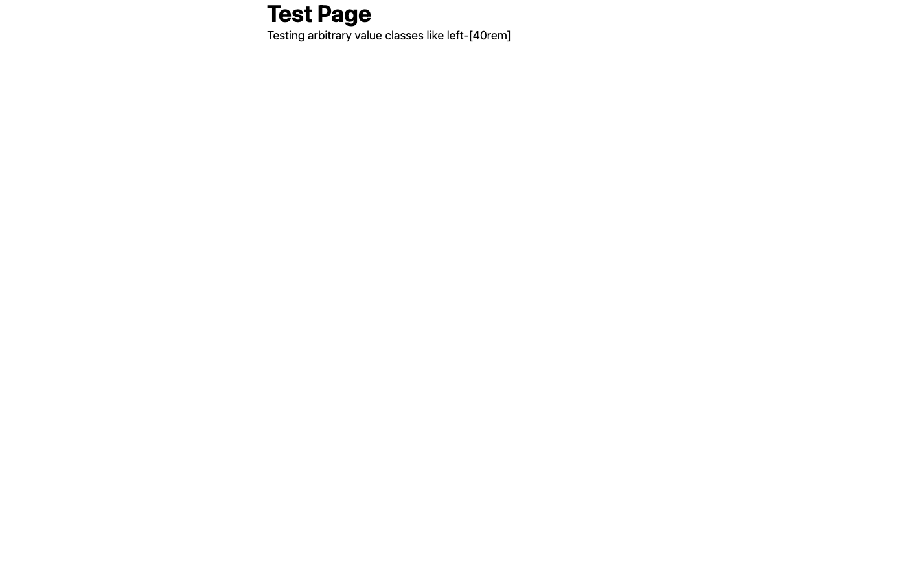

# Tailwind CSS v4 Architecture-Specific CSS Generation Bug

## 🐛 Bug Description

Tailwind CSS v4 generates **different CSS output** when run on ARM64 vs AMD64 architectures, using identical input files. This causes production deployments on AMD64 servers to have missing CSS compared to local ARM64 development environments.

## 🖼️ Visual Proof

The bug causes visible differences in the rendered page:

### AMD64 Build - Missing Gradient


### ARM64 Build - Gradient Displays Correctly


## 📊 Technical Details

- **Affected Version**: Tailwind CSS v4.0.0 through v4.1.10 (latest)
- **Does NOT affect**: Tailwind CSS v3.x
- **File Size Difference**: ARM64 generates 5,363 extra bytes (6.4% larger)
- **Missing CSS**: Arbitrary value classes like `left-[40rem]` are not generated on AMD64

## 🔄 Reproduction Steps

### Quick Start (Docker Compose)
```bash
# Clone this repository
git clone https://github.com/yourusername/tailwindcss-v4-arch-bug.git
cd tailwindcss-v4-arch-bug

# Run the test (requires Docker with buildx)
docker compose up

# Or use the verification script
./verify.sh
```

### Manual Steps
1. Build Tailwind v4 Docker images for both architectures
2. Run the same input files through both builds
3. Compare the output CSS files
4. Notice AMD64 is missing CSS rules that ARM64 includes

## 📋 Test Results

```
Tailwind v3 (EXPECTED: identical output):
  AMD64: 11,753 bytes
  ARM64: 11,753 bytes
  ✅ PASS: Files are identical

Tailwind v4 (BUG: different output):
  AMD64: 83,996 bytes
  ARM64: 89,359 bytes
  ❌ BUG CONFIRMED: Files differ!
  Difference: 5,363 bytes
  
  Checking for left-[40rem] class:
  AMD64: 0 occurrences
  ARM64: 2 occurrences
```

## 🎯 Impact

1. **Production Breakage**: Sites developed on ARM64 Macs break when deployed to AMD64 servers
2. **Missing Features**: Arbitrary value positioning classes don't work on AMD64
3. **Silent Failure**: No build errors - the CSS is just missing
4. **Phoenix 1.8 Users**: Affects new Phoenix 1.8.0-rc.3 projects using Tailwind v4

## 🔍 Root Cause

The architecture-specific Tailwind v4 binaries appear to parse/generate CSS differently. The AMD64 binary fails to generate CSS for arbitrary value classes like `left-[40rem]` while the ARM64 binary works correctly.

## 🛠️ Workarounds

1. **Use Tailwind v3**: Not affected by this bug
2. **Match Architectures**: Ensure dev and prod use the same CPU architecture
3. **Build on Target**: Generate CSS on the deployment architecture
4. **Use Standard Classes**: Avoid arbitrary value classes until fixed

## 📝 Test Files

- `test.html` - Minimal HTML with `left-[40rem]` class
- `v3/` - Tailwind v3 test (works correctly)
- `v4/` - Tailwind v4 test (exhibits bug)
- `docker-compose.yml` - Automated test runner
- `verify.sh` - Standalone verification script

## 🔗 Related Issues

- Phoenix Framework: [Link to Phoenix issue]
- Original Discovery: [Link to discussion]

---

**Note**: This is a critical bug affecting production deployments. The visual difference shown above is just one example - any arbitrary value class may be affected.